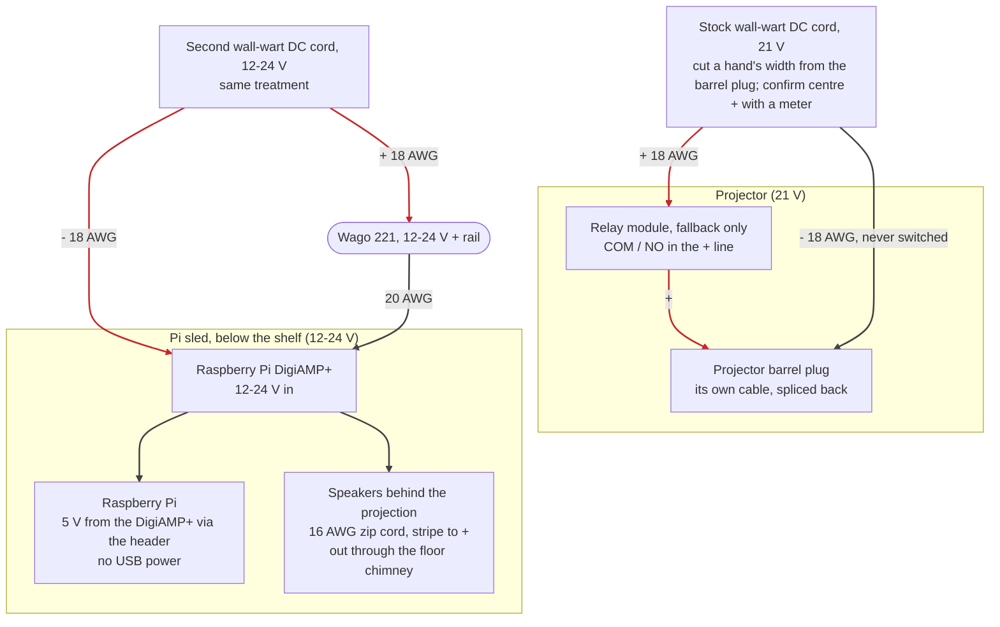
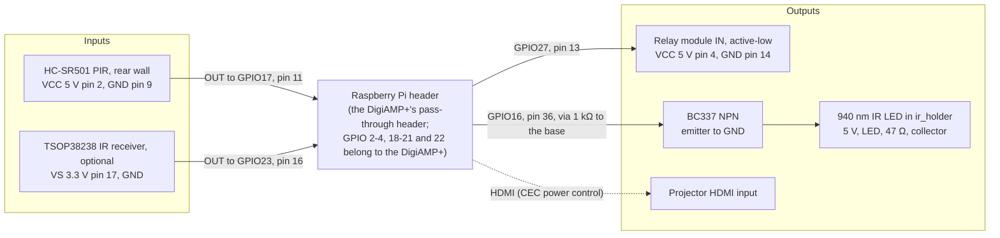

# Wiring and fuse

> **Mains voltage is inside this box.** If you are not confident wiring mains, have a qualified electrician do the AC side. Nothing here has been built or tested yet; check every rating against the labels on your own parts.

This case is rain-shedding and ventilated, not waterproof, and not certified for anything.

## Overview

One diagram per side of the barrier on the power shelf: [high voltage](#high-voltage-ac-side) (mains, left of the barrier: the receptacle plate with both wall-warts) and [low voltage](#low-voltage-side) (right of the barrier and down to the sled, drawn as the two DC rails and then the Pi's signals). Each comes twice: a schematic (`docs/wiring-*.svg`, drawn by `scripts/render_wiring.py` with [Schemdraw](https://schemdraw.readthedocs.io/); click one for full size) and a flowchart of the same connections. Red is live or +, grey is neutral or -, green is earth, blue is a signal. Pin numbers are the Pi header's physical pins; GPIO assignments and the reasoning behind them are in `pi/README.md` ("GPIO pins and wiring"). The AC fuse value on the schematic is the example from "AC fuse and DC protection" below; size yours from your own labels.

## High voltage: AC side

Everything left of the barrier on the power shelf. Nothing but the two wall-warts' DC cords crosses the barrier, through the notch at its foot.

```mermaid
flowchart LR
  subgraph OUT["Outside the case"]
    direction LR
    GFCI["Outdoor GFCI outlet<br/>in-use cover; test its button"]
    BOX["Weatherproof connection box<br/>(only if you join an extension cord)"]
    LOOP["Drip loop<br/>below the gland"]
  end
  subgraph WALL["Rear wall, rear-left corner of the Pi zone"]
    GLAND["PG9 cord grip<br/>level with the lower receptacle's tabs"]
  end
  subgraph ACS["Power shelf, AC side (left of the barrier): the receptacle plate"]
    FAC["5 x 20 mm inline holder<br/>time-delay fuse<br/>LIVE ONLY"]
    R1["Lower NEMA 5-15R (SS-6B)<br/>L / N / E tabs, identified by probing<br/>fully insulated quick-connects"]
    R2["Upper NEMA 5-15R<br/>jumpered from the lower<br/>(piggyback quick-connects)"]
    W1["Stock wall-wart, unmodified<br/>21 V 2.28 A, 2-pin"]
    W2["Second wall-wart, unmodified<br/>12-24 V, 2.5-3 A, 2-pin"]
  end
  NOTCH["Notch at the barrier foot<br/>DC cords only cross here"]
  GFCI -- "SJTW 18 AWG, 3-wire" --> BOX --> LOOP --> GLAND
  GLAND -- "L: black / smooth (narrow blade)" --> FAC
  FAC -- "L to the live tab (probe to identify)" --> R1
  GLAND -- "N: white / ribbed (wide blade), to the neutral tab" --> R1
  GLAND -. "E: green, to the earth tab (nothing uses it)" .-> R1
  R1 -- "L / N / E jumper" --> R2
  R1 --> W1
  R2 --> W2
  W1 -- "21 V DC cord" --> NOTCH
  W2 -- "12-24 V DC cord" --> NOTCH
  linkStyle 3,4 stroke:#c62828,stroke-width:2px
  linkStyle 5 stroke:#9e9e9e,stroke-width:2px
  linkStyle 6 stroke:#2e7d32,stroke-width:2px
```

1. **Supply.** Keep every plug-and-socket joint off the ground and out of puddles: put any extension-cord joint in a weatherproof connection box (a clamshell "cord connection" cover) and raise it off the lawn. Plug into an outdoor GFCI outlet (US code already requires GFCI for outdoor receptacles; test it with its button). Use an outdoor-rated cord (SJTW or better, 18 AWG minimum) and an in-use weatherproof cover on the outlet.
2. **Cord entry.** The cord enters through the PG9 cord grip in the rear wall, above the shelf. Tighten the grip on the round cord jacket. Leave a drip loop outside, below the grip, so water drips off before reaching it.
3. **Receptacles.** The projector's stock supply is a wall-wart (MX48CC-210228US: AC 100-240 V 1.0 A in, 21 V 2.28 A / 48 W out, centre-positive, 2-pin non-polarized prongs, captive DC cord), so the shelf's plate carries two panel-mount NEMA 5-15R snap-in receptacles facing the divider: the stock wall-wart plugs into the lower one and stands on the shelf on its long edge; the second wall-wart (the 12-24 V rail for the Pi and DigiAMP+) plugs into the upper one and rests on the first. Both hang on their prongs; a velcro strap through the shelf slots round both keeps them seated. Wire the receptacles' tabs with **fully insulated** female quick-connects (the SS-6B drawing gives no tab width and no tab colours: measure the tabs and match the connectors, and find which tab reaches which slot with a continuity meter before you crimp anything, since its two blade slots look the same size): live from the fuse to the tab behind the live slot, neutral from the cord to the neutral tab, earth to the earth tab. Mark all three before wiring. If the second supply turns out to be a desktop brick with its own AC cord (the Facmogu in the order looks like one), its cord plugs into the upper receptacle and the brick rests on the shelf under the strap. Jumper the second receptacle from the first with piggyback quick-connects, or two crimps per tab. Leave the wall-warts unmodified on the AC side.
4. **AC fuse.** An inline fuse holder on the **live** (hot) conductor only, between the cord grip and the first receptacle. US polarized plugs: the live is the narrow blade, usually the smooth or black conductor.
5. **Earth.** The wall-warts are 2-pin Class II, so nothing uses the earth contact. Use a 3-wire cord and land its green on both receptacles' earth tabs anyway: it costs nothing and covers anything 3-pin that is ever plugged in there.
6. **Insulate.** Every AC joint is inside a connector shell or heat-shrink. No bare metal, no tape-only joints. The spade terminals sit behind the plate, in the corner with the gland, away from the low-voltage side.
7. **Cord drop.** The cord comes through the gland in the rear-left corner, level with the lower receptacle's terminals, and runs behind the plate to them. The plate stands 40 mm off the rear wall (`rcpt_back`) but the SS-6B's terminals reach about 30.6 mm behind the panel, which leaves about 9 mm for the spades and the cord: bend the wires sideways right at the spades, and keep every bend no tighter than the cord's own radius.

## Low-voltage side

Right of the barrier, and down to the Pi sled.

### DC rails

The two rails are separate: each wall-wart's minus goes straight to its own load, and nothing joins them. Both wall-warts are isolated (floating) outputs, so each load's current returns to its own supply; the HDMI cable's shield joins the grounds anyway, as it does for any projector and Pi with their own adapters. The relay is only needed if the projector lacks HDMI-CEC (see `pi/README.md`, "Projector power"). It is also the only way the Pi can cut the projector's power if the Pi itself overheats: with CEC alone it can only ask for standby, so consider fitting it anyway (see `pi/README.md`, "Cooling"). The relay opens whenever the Pi's service stops. Use an **active-low** module: the Pi holds GPIO 27 high (relay open, projector off) from boot.

| Circuit | Wire | Notes |
|---|---|---|
| Stock wall-wart DC lead to the projector | 18 AWG (0.75 mm²) | Cut the lead a hand's width from its barrel plug (the label's symbol says centre +; confirm with a meter before cutting) and splice it back with lever nuts, so the projector keeps its own plug, and put the BOM's right-angle 5.5 x 2.5 mm adapter between the projector's jack and that plug, so the stock cable's 45 mm bend runs along the rear face (a straight plug would need about 45 mm behind it, which the rear gap can't give). The relay, if fitted, goes in this + line |
| Second wall-wart DC lead to the splice | 18 AWG | Same treatment: lever-nut splice. 12-24 V (the DigiAMP+'s range; higher gives it more power) |
| Each wall-wart's **minus** conductor | 18 AWG | Straight to its own load (projector, or the splice to the DigiAMP+). Don't join the two minuses: the HDMI shield already ties the grounds, and nothing needs a second link |
| Splice to DigiAMP+ power input | 20 AWG (0.5 mm²) | DigiAMP+ accepts 12-24 V on its P5 hard-wire header (or its 5.5 x 2.5 mm centre-positive barrel jack); it powers the Pi, so never also power the Pi by USB |
| Relay (fallback only) | 18 AWG | Switch the **+** line to the projector. Never switch its ground: the HDMI cable would then carry the projector's return current. Use an **active-low** module: the Pi holds GPIO 27 high (relay open, projector off) from boot |
| DigiAMP+ to speakers | 16 AWG zip cord | Out through the floor chimney; red/striped to + on both ends |

Use lever-nut connectors (e.g. Wago 221) for the splice so it can be undone. Pass low-voltage wires from the shelf to the Pi through the wire slot at the back of the shelf, never across the barrier's AC side.

**Projector cables.** The DC barrel plug goes on the projector's rear face, top-right corner: put the right-angle 5.5 x 2.5 mm adapter from the BOM on the jack, pointing back. HDMI goes on the I/O strip on the right face: use a right-angle plug, and run the cable back along the side gap above the baffle. Leave USB, AV and Type-C unplugged; their plugs would foul the side gap.

### Pi header signals

The DigiAMP+ re-exposes the header on top, so the leads plug into its pass-through header (a Zero 2 W needs its own 40-pin header soldered first). GPIO 22 is the DigiAMP+ mute line, which is why the IR LED sits on GPIO 16. The IR LED needs the transistor: a GPIO pin can only source 16 mA.

## Cords outdoors

Trick-or-treaters walk through the yard in the dark. Run the power cord and speaker wires along edges, not across paths. Where they must cross a path, use a rubber cord cover (cable ramp), or bury or stake them flat. Keep every plug joint in a weatherproof connection box, off the ground.

## AC fuse and DC protection

Fill this in from **your** labels. The stock wall-wart reads 1.0 A in and 21 V 2.28 A (48 W) out; the TO2's own label says DC 21 V 3 A, so the supply has no headroom beyond the projector. The example assumes that wall-wart plus the 24 V 3 A 72 W Facmogu from the BOM, whose input rating I have not read off its label (72 W supplies commonly say about 1.5 A): replace the figure with your own label.

| Fuse | How to size it | Type | Example |
|---|---|---|---|
| AC fuse (live) | About 1.5x the **sum** of both wall-warts' rated input currents (the labels' "Input ... A"), and no more than the cord's rating | 5 x 20 mm, **time-delay (T)**, 250 V: switch-mode supplies have an inrush surge | 1.0 + 1.5 = 2.5 A gives about 3.75 A, so **4 A T**; a second supply labelled 0.8 A in gives 1.0 + 0.8 = 1.8 A and **3 A T** (2.5 A T if you can get it) |

**No DC fuses.** Each wall-wart limits its own output current and carries its own short-circuit protection, and its rated output is far below what the 18 AWG leads can carry, so a fault downstream cannot overheat the wire. Buy a UL/ETL-listed second wall-wart (short-circuit protected) and keep each rail's load under its output rating: the DigiAMP+ at your volume plus the Pi for the second one. If it doesn't fit, buy a bigger wall-wart.

## Before first power-up

1. With nothing plugged in, check continuity: live, neutral (and earth, if used) each reach only where they should, with no short between them.
2. Confirm the AC fuse sits in the **live** conductor.
3. With both wall-warts plugged in but the splices open, measure each rail's DC voltage and polarity at its splice. The stock wall-wart's label symbol says centre-positive; confirm it with the meter anyway.
4. Connect loads one at a time: the DigiAMP+ (the Pi should boot), then the projector.
5. Close the lid, then test the GFCI outlet's trip button with the case running: everything must go dark.
