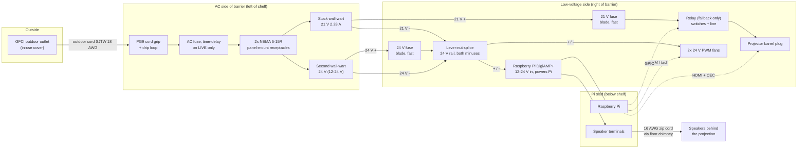

# Wiring and fuses

> **Mains voltage is inside this box.** If you are not confident wiring mains, have a qualified electrician do the AC side. Nothing here has been built or tested yet; check every rating against the labels on your own parts.

This case is rain-shedding and ventilated, not waterproof, and not certified for anything.

## Overview

Solid lines carry power. Dotted lines are signals. The relay is only needed if the projector lacks HDMI-CEC (see `pi/README.md`, "Projector power"). It is also the only way the Pi can cut the projector's power on over-temperature: with CEC alone it can only ask for standby, so consider fitting it anyway (see `pi/README.md`, "Cooling"). The relay opens whenever the Pi's service stops. GPIO pin assignments are in `pi/README.md` (PIR 17, relay 27, IR LED 22, IR receiver 23, fan PWM 12/13, fan tach 24/25, 1-wire 26; the DigiAMP+ uses 2, 3, 4 and 18-21). The DigiAMP+ covers the header, so fit a stacking header or solder leads under the Pi.

## AC side

Everything left of the barrier on the power shelf.

1. **Supply.** Keep every plug-and-socket joint off the ground and out of puddles: put any extension-cord joint in a weatherproof connection box (a clamshell "cord connection" cover) and raise it off the lawn. Plug into an outdoor GFCI outlet (US code already requires GFCI for outdoor receptacles; test it with its button). Use an outdoor-rated cord (SJTW or better, 18 AWG minimum) and an in-use weatherproof cover on the outlet.
2. **Cord entry.** The cord enters through the PG9 cord grip in the rear wall, above the shelf. Tighten the grip on the round cord jacket. Leave a drip loop outside, below the grip, so water drips off before reaching it.
3. **Receptacles.** The projector's stock supply is a wall-wart (MX48CC-210228US: AC 100-240 V 1.0 A in, 21 V 2.28 A / 48 W out, centre-positive, 2-pin non-polarized prongs, captive DC cord), so the shelf's plate carries two panel-mount NEMA 5-15R snap-in receptacles facing the divider: the stock wall-wart plugs into the lower one and stands on the shelf on its long edge; the second wall-wart (the 24 V rail for the Pi, DigiAMP+ and fans) plugs into the upper one and rests on the first. Both hang on their prongs; a velcro strap through the shelf slots round both keeps them seated. Wire the receptacles' 4.8 mm tabs with **fully insulated** female quick-connects: live from the fuse to the brass (narrow-slot) tab, neutral from the cord to the silver (wide-slot) tab, earth to the green tab. Jumper the second receptacle from the first with piggyback quick-connects, or two crimps per tab. Leave the wall-warts unmodified on the AC side.
4. **AC fuse.** An inline fuse holder on the **live** (hot) conductor only, between the cord grip and the first receptacle. US polarized plugs: the live is the narrow blade, usually the smooth or black conductor.
5. **Earth.** The wall-warts are 2-pin Class II, so nothing uses the earth contact. Use a 3-wire cord and land its green on both receptacles' earth tabs anyway: it costs nothing and covers anything 3-pin that is ever plugged in there.
6. **Insulate.** Every AC joint is inside a connector shell or heat-shrink. No bare metal, no tape-only joints. The spade terminals sit behind the plate, in the corner with the gland, away from the low-voltage side.
7. **Cord drop.** The cord comes through the gland in the rear-left corner, level with the lower receptacle's terminals, and runs behind the plate to them: 30 mm of room, no bend tighter than the cord's own radius.

## Low-voltage side

Right of the barrier, and down to the Pi sled.

| Circuit | Wire | Notes |
|---|---|---|
| Stock wall-wart DC lead to the 21 V fuse and the projector | 18 AWG (0.75 mm²) | Cut the lead a hand's width from its barrel plug, fuse the **+** conductor (the label's symbol says centre +; confirm with a meter before cutting) and splice it back with lever nuts, so the projector keeps its own plug. The relay, if fitted, goes in this + line |
| Second wall-wart DC lead to the 24 V fuse and splice | 18 AWG | Same treatment: fuse the +, lever-nut splice. 24 V keeps the fans on their rated voltage and the DigiAMP+ inside its 12-24 V range; 12-24 V works if the fans match |
| Both rails' **minus** conductors | 18 AWG | Join them at the splice. The projector's HDMI shield ties its ground to the Pi's; without this joint that shield would be the only return path between the rails |
| Splice to DigiAMP+ power input | 20 AWG (0.5 mm²) | DigiAMP+ accepts 12-24 V on its P5 hard-wire header (or its 5.5 x 2.5 mm centre-positive barrel jack); it powers the Pi, so never also power the Pi by USB |
| Splice to fans | 24 AWG | Fans must match the second rail's voltage (24 V fans on a 24 V wall-wart); PWM and tach go to the Pi. With Cooling off in the settings, or the service stopped, the fans run at full speed |
| Relay (fallback only) | 18 AWG | Switch the **+** line to the projector. Never switch its ground: the HDMI cable would carry the return current. Use an **active-low** module: the Pi holds GPIO 27 high (relay open, projector off) from boot |
| DigiAMP+ to speakers | 16 AWG zip cord | Out through the floor chimney; red/striped to + on both ends |

Use lever-nut connectors (e.g. Wago 221) for the splice so it can be undone. Pass low-voltage wires from the shelf to the Pi through the wire slot at the back of the shelf, never across the barrier's AC side.

## Cords outdoors

Trick-or-treaters walk through the yard in the dark. Run the power cord and speaker wires along edges, not across paths. Where they must cross a path, use a rubber cord cover (cable ramp), or bury or stake them flat. Keep every plug joint in a weatherproof connection box, off the ground.

## Fuse sizing

Fill this in from **your** labels. The stock wall-wart reads 1.0 A in and 21 V 2.28 A (48 W) out; the TO2's own label says DC 21 V 3 A, so the supply has no headroom beyond the projector. The example column assumes that wall-wart plus a 24 V 2.5 A second one with a 0.8 A input rating.

| Fuse | How to size it | Type | Example |
|---|---|---|---|
| AC fuse (live) | About 1.5x the **sum** of both wall-warts' rated input currents (the labels' "Input ... A"), and no more than the cord's rating | 5 x 20 mm, **time-delay (T)**, 250 V: switch-mode supplies have an inrush surge | 1.0 + 0.8 = 1.8 A gives **3 A T** (2.5 A T if you can get it) |
| 21 V rail (stock wall-wart) | The wall-wart's rated output is 2.28 A and the projector can draw all of it, so a fuse at that rating would run at its limit. Use the next size up: it protects the 18 AWG lead (good for far more), and the wall-wart has its own overload protection | Automotive blade (ATO/ATC), inline holder | **3 A** |
| 24 V rail (second wall-wart) | No more than its rated output, and at least 1.25x the DigiAMP+ + Pi + fans load | Blade | 2.5 A wall-wart gives **2.5 A** (or 3 A) |

Check the second rail's total: DigiAMP+ at your volume + the Pi + two fans must stay under that wall-wart's output rating with some margin. If it doesn't, buy a bigger wall-wart; a fuse won't fix that.

## Before first power-up

1. With nothing plugged in, check continuity: live, neutral (and earth, if used) each reach only where they should, with no short between them.
2. Confirm the AC fuse sits in the **live** conductor.
3. With both wall-warts plugged in but the splices open, measure each rail's DC voltage and polarity at its fuse. The stock wall-wart's label symbol says centre-positive; confirm it with the meter anyway.
4. Connect loads one at a time: fans, then the DigiAMP+ (the Pi should boot), then the projector.
5. Close the lid, then test the GFCI outlet's trip button with the case running: everything must go dark.
