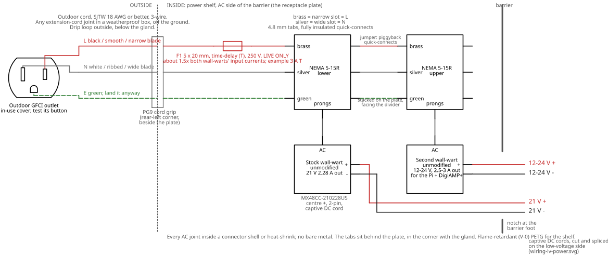
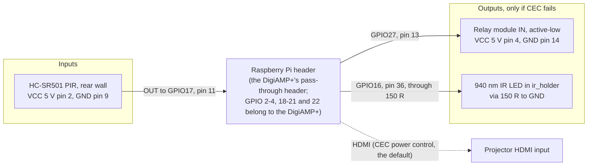

# Wiring

> **Mains voltage is inside this box.** If you are not confident wiring mains, have a qualified electrician do the AC side. Nothing here has been built or tested yet; check every rating against the labels on your own parts.

This case is rain-shedding and ventilated, not waterproof, and not certified for anything.

## Overview

One diagram per side of the power shelf: [AC supply](#ac-supply) (the cord, the clamp and the 24 V brick) and [low voltage](#low-voltage-side) (on the shelf and down to the sled, drawn as the one DC rail and then the Pi's signals). Each comes twice: a schematic (`docs/wiring-*.svg`, drawn by `scripts/render_wiring.py` with [Schemdraw](https://schemdraw.readthedocs.io/); click one for full size) and a flowchart of the same connections. Red is live or +, grey is neutral or -, green is earth, blue is a signal. Pin numbers are the Pi header's physical pins; GPIO assignments and the reasoning behind them are in `pi/README.md` ("GPIO pins and wiring").

## AC supply

Nothing is hand-wired on the AC side: no stripped conductors, no spade terminals, no fuse holder. The cord's molded connector goes straight into the brick's inlet.

1. **Supply.** Plug into an outdoor GFCI outlet with an in-use weatherproof cover and test its button. Keep every plug-and-socket joint off the ground and out of puddles, in the weatherproof connection box.
2. **The cord.** A standard detachable cord with the right connector for the brick's inlet (read the inlet type off the brick's label: IEC C8, C14, C6 and so on). It is **not outdoor-rated**: the owner accepts that for the Halloween 2026 run (about a month outside) and replaces it if the jacket is damaged. Inspect the whole length daily; unplug and replace at the first nick, crack or soft spot.
3. **Entry.** The connector passes through the opening in the rear wall into the case and plugs into the brick; then the two halves of the cord clamp close round the jacket over a 2 mm foam gasket and screw into the wall's bosses (4x M3 x 16 self-tapping). The clamp is meant to take the pull; prove it with BRINGUP row 17a before the lid goes on. Leave a drip loop outside, below the clamp. Pull test before the lid goes on: a firm tug along and across the cord must not move the connector in the brick (BRINGUP row 17a).
4. **The brick** lies on the shelf under a velcro strap through the shelf slots, toward the rear wall. Its DC cord is not cut.
5. **No AC fuse.** There is no hand-wired AC conductor left to protect: the cord and brick are molded parts. The brick must be UL/ETL listed (check its label) and has its own protection, and the GFCI/branch breaker is upstream. If you would rather have one, buy an inline-fused cord for the brick's inlet type.
6. **Earth.** If the brick has a 3-pin inlet, use the 3-wire cord. A 2-pin Class II inlet needs none.

Mains is still present inside the printed box (the cord's connector and the brick's inlet). Print the shelf in flame-retardant PETG as before.

## Low-voltage side

On the shelf, and down to the Pi sled.

### DC rail

One rail, one return: the Y-splitter joins both loads' minuses at the supply, so there is no second rail to tie in and no ground path through the HDMI shield. Nothing on the DC side is cut or spliced in the baseline build. The projector's label says 21 V and the brick makes 24 V: **leg 1 is not connected to the projector until BRINGUP row 4a (projector on 24 V) has passed.**

**Check the polarity before connecting either load.** With the brick plugged in and nothing else connected, meter each Y-splitter leg's tip: it must read 24 V with the **centre positive** (the brick's label, the projector's label symbol and the DigiAMP+'s jack all say centre +). If either leg reads negative, stop: the splitter is wired the wrong way round for this supply.

The DigiAMP+ powers the Pi, so never also power the Pi by USB. The relay is only needed if the projector lacks HDMI-CEC (see `pi/README.md`, "Projector power"). It is also the only way the Pi can cut the projector's power if the Pi itself overheats: with CEC alone it can only ask for standby. **If you fit it:** cut leg 1 a hand's width from the adapter, put the relay's COM and NO in the **+** conductor only, and splice with the lever connectors (BOM relay row). Never switch the minus: the HDMI cable would carry the return. Use an **active-low** module: the Pi holds GPIO 27 high (relay open, projector off) from boot.

| Circuit | Wire | Notes |
|---|---|---|
| Brick DC cord into the Y-splitter | the cord's own | Plug-in; the cord is not cut. Tip must read centre + |
| Y-splitter leg 1 to the projector | the splitter's own | **Leads rated for the supply's 5 A, or a fuse in each leg sized to the lead's rating.** Ends in the right-angle 5.5 x 2.5 mm adapter on the projector's DC jack so the stock cable's bend runs along the rear face. **Do not connect it until row 4a passes.** If row 4a fails, a buck converter to 21 V goes between the splitter and the adapter on this leg only (at least 3.5 A out at 21 V, 30 V in or more; meter its output before it meets the projector) |
| Y-splitter leg 2 to the DigiAMP+ | the splitter's own | Into the DigiAMP+'s 5.5 x 2.5 mm centre-positive barrel jack. 24 V is its stated ceiling |
| Relay (CEC fallback only) | 18 AWG | Cut leg 1 a hand's width from the adapter and switch the **+** conductor only. Never switch the minus: the HDMI cable would carry the return. Use an **active-low** module: the Pi holds GPIO 27 high (relay open, projector off) from boot |
| DigiAMP+ to speakers | 16 AWG zip cord | Out through the floor chimney; red/striped to + on both ends |

Pass low-voltage wires from the shelf to the Pi through the wire slot at the back of the shelf; the DigiAMP+ leg's barrel plug must fit it (BRINGUP row 4).

**Projector cables.** The DC barrel plug goes on the projector's rear face, top-right corner: put the right-angle 5.5 x 2.5 mm adapter from the BOM on the jack, pointing back. HDMI goes on the I/O strip on the right face: use a right-angle plug, and run the cable back along the side gap above the baffle. Leave USB, AV and Type-C unplugged; their plugs would foul the side gap.

### Pi header signals

The DigiAMP+ re-exposes the header on top, so the leads plug into its pass-through header (a Zero 2 W needs its own 40-pin header soldered first). GPIO 22 is the DigiAMP+ mute line, which is why the IR LED sits on GPIO 16. The relay and the IR LED are built only if bring-up row 9 shows the projector ignores CEC. The LED needs no transistor: from 3.3 V through 150 R it draws about 13 mA, under a pin's 16 mA, and it sits centimetres from the projector's receiver; if row 22 shows it too weak, add a BC337 and 1 k. The TSOP38238 receiver (GPIO 23) is a bench tool to learn the remote's code, not part of the case.

## Cords outdoors

Trick-or-treaters walk through the yard in the dark. Run the power cord and speaker wires along edges, not across paths. Where they must cross a path, use a rubber cord cover (cable ramp), or bury or stake them flat. Keep every plug joint in a weatherproof connection box, off the ground.

## Protection

**No AC fuse and no DC fuse in the baseline.** The AC side has no hand-wired conductor to protect (see "AC supply"). The brick limits its own output and carries its own short-circuit protection. The one place a fault could heat a wire is the Y-splitter's leads: a 5 A supply can overheat leads rated for less. Buy a splitter whose leads are rated for 5 A, or put a small inline fuse in each leg sized to that leg's lead rating. Use a UL/ETL-listed brick (read its label on arrival) and keep the total load under its 120 W.

## Before first power-up

1. With nothing plugged in, check the cord's continuity end to end and that the connector seats fully in the brick.
2. Brick plugged in, loads unplugged: meter each Y-splitter leg's tip (24 V, centre +).
3. Projector tested on the brick on the bench (BRINGUP row 4a) before leg 1 is connected.
4. Connect the DigiAMP+ (the Pi should boot), then the projector.
5. Close the lid, then test the GFCI outlet's trip button with the case running: everything must go dark.
