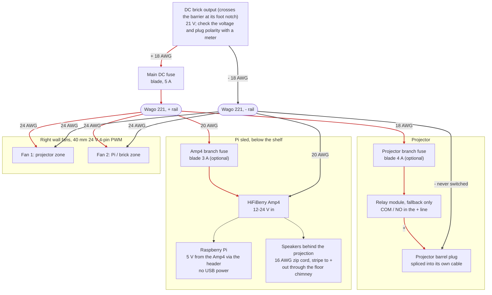
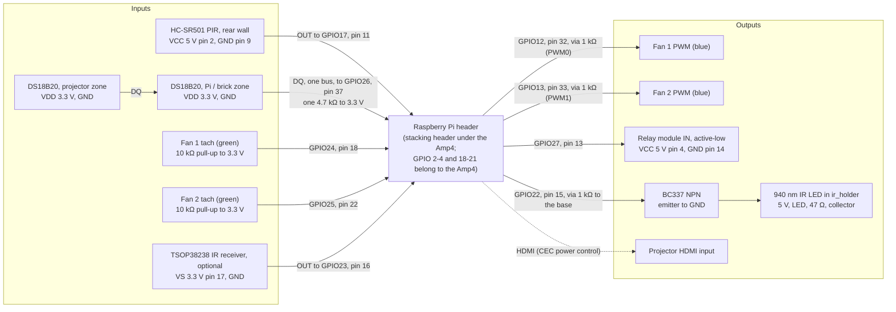

# Wiring and fuses

> **Mains voltage is inside this box.** If you are not confident wiring mains, have a qualified electrician do the AC side. Nothing here has been built or tested yet; check every rating against the labels on your own parts.

This case is rain-shedding and ventilated, not waterproof, and not certified for anything.

## Overview

One diagram per side of the barrier on the power shelf: [high voltage](#high-voltage-ac-side) (mains, left of the barrier) and [low voltage](#low-voltage-side) (right of the barrier and down to the sled, drawn as the 21 V rail and then the Pi's signals). Red edges are live or +, grey are neutral or -, green is earth, dotted are signals. Pin numbers are the Pi header's physical pins; GPIO assignments and the reasoning behind them are in `pi/README.md` ("GPIO pins and wiring").

## High voltage: AC side

Everything left of the barrier on the power shelf. Nothing but the brick's DC cord crosses the barrier, through the notch at its foot.

```mermaid
flowchart LR
  subgraph OUT["Outside the case"]
    direction LR
    GFCI["Outdoor GFCI outlet<br/>in-use cover; test its button"]
    BOX["Weatherproof connection box<br/>(only if you join an extension cord)"]
    LOOP["Drip loop<br/>below the gland"]
  end
  subgraph WALL["Rear wall, above the shelf"]
    GLAND["PG9 cord grip<br/>tightened on the cord jacket"]
  end
  subgraph ACS["Power shelf, AC side (left of the barrier)"]
    FAC["5 x 20 mm inline holder<br/>time-delay fuse<br/>LIVE ONLY"]
    IEC["Rewireable IEC connector<br/>C7 / C5 / C13 to match the brick"]
    BRICK["DC brick, unmodified<br/>(AC terminals inside the connector shell)"]
  end
  NOTCH["Notch at the barrier foot<br/>DC cord only crosses here"]
  GFCI -- "SJTW 18 AWG, 2- or 3-wire" --> BOX --> LOOP --> GLAND
  GLAND -- "L: black / smooth (narrow blade)" --> FAC
  FAC -- "L" --> IEC
  GLAND -- "N: white / ribbed (wide blade)" --> IEC
  GLAND -. "E: green, C5 / C13 bricks only" .-> IEC
  IEC --> BRICK
  BRICK -- "21 V DC out" --> NOTCH
  linkStyle 3,4 stroke:#c62828,stroke-width:2px
  linkStyle 5 stroke:#9e9e9e,stroke-width:2px
  linkStyle 6 stroke:#2e7d32,stroke-width:2px
```

1. **Supply.** Keep every plug-and-socket joint off the ground and out of puddles: put any extension-cord joint in a weatherproof connection box (a clamshell "cord connection" cover) and raise it off the lawn. Plug into an outdoor GFCI outlet (US code already requires GFCI for outdoor receptacles; test it with its button). Use an outdoor-rated cord (SJTW or better, 18 AWG minimum) and an in-use weatherproof cover on the outlet.
2. **Cord entry.** The cord enters through the PG9 cord grip in the rear wall, above the shelf. Tighten the grip on the round cord jacket. Leave a drip loop outside, below the grip, so water drips off before reaching it.
3. **Leave the brick unmodified.** Most projector bricks take a detachable AC cord (IEC C7 "figure 8", C5 "cloverleaf" or C13). Fit a **rewireable** IEC connector of the same type to the end of your outdoor cord inside the case and plug it into the brick. If your brick has a captive cord instead, stop and get the AC side wired by someone qualified.
4. **AC fuse.** An inline fuse holder on the **live** (hot) conductor only, between the cord grip and the IEC connector. US polarized plugs: the live is the narrow blade, usually the smooth or black conductor.
5. **Earth.** If the brick's inlet has an earth pin (C5, C13), use a 3-wire cord and keep earth continuous. A 2-pin inlet (C7) means a double-insulated (Class II) brick; a 2-wire cord is correct.
6. **Insulate.** Every AC joint is inside a connector shell or heat-shrink. No bare metal, no tape-only joints.

## Low-voltage side

Right of the barrier, and down to the Pi sled.

### 21 V rail

The relay is only needed if the projector lacks HDMI-CEC (see `pi/README.md`, "Projector power"). It is also the only way the Pi can cut the projector's power on over-temperature: with CEC alone it can only ask for standby, so consider fitting it anyway (see `pi/README.md`, "Cooling"). The relay opens whenever the Pi's service stops. Use an **active-low** module: the Pi holds GPIO 27 high (relay open, projector off) from boot.

| Circuit | Wire | Notes |
|---|---|---|
| Brick DC out to main fuse and splice | 18 AWG (0.75 mm²) | Check the brick's plug polarity (centre + is common, not universal) before cutting |
| Splice to projector | 18 AWG | Keep the projector's own barrel plug; splice into its cable |
| Splice to Amp4 power input | 20 AWG (0.5 mm²) | Amp4 accepts 12-24 V; it powers the Pi, so don't also power the Pi by USB |
| Splice to fans | 24 AWG | 24 V fans on the 21 V rail (12 V fans would burn); PWM and tach go to the Pi. With Cooling off in the settings, or the service stopped, the fans run at full speed |
| Relay (fallback only) | 18 AWG | Switch the **+** line to the projector. Never switch its ground: the HDMI cable would carry the return current. Use an **active-low** module: the Pi holds GPIO 27 high (relay open, projector off) from boot |
| Amp4 to speakers | 16 AWG zip cord | Out through the floor chimney; red/striped to + on both ends |

Use lever-nut connectors (e.g. Wago 221) for the splice so it can be undone. Pass low-voltage wires from the shelf to the Pi through the wire slot at the back of the shelf, never across the barrier's AC side.

### Pi header signals

The Amp4 covers the header, so fit a stacking header or solder leads under the Pi. Every tach and 1-wire pull-up goes to **3.3 V**, never to the 21 V rail or 5 V. The fans and the Pi must share a ground. The IR LED needs the transistor: a GPIO pin can only source 16 mA.

## Cords outdoors

Trick-or-treaters walk through the yard in the dark. Run the power cord and speaker wires along edges, not across paths. Where they must cross a path, use a rubber cord cover (cable ramp), or bury or stake them flat. Keep every plug joint in a weatherproof connection box, off the ground.

## Fuse sizing

Fill this in from **your** labels. The TO2's label reads DC 21 V 3 A (confirm it with a meter), and its stock brick is rated for the projector alone: feeding the Amp4, Pi and fans too needs a 21 V brick of 5 A or more. The example column assumes a 21 V 5 A brick, the projector drawing 3 A and a 110 W-class brick input.

| Fuse | How to size it | Type | Example |
|---|---|---|---|
| AC fuse (live) | About 1.5x the brick's rated **input** current (the label's "Input ... A"), and no more than the cord's rating | 5 x 20 mm, **time-delay (T)**, 250 V: switch-mode bricks have an inrush surge | Label "1.2 A" gives **2 A T** |
| Main DC fuse | No more than the brick's rated **output** current, and at least 1.25x the normal total load | Automotive blade (ATO/ATC), inline holder | Brick 5 A gives **5 A** |
| Projector branch (optional) | 1.25x the projector's rated input (on its DC jack or label) | Blade | 3 A projector gives **4 A** |
| Amp4 branch (optional) | Covers the amp at full volume plus the Pi | Blade | **3 A** |

Check the total: projector + Amp4 (amp + Pi) + fans must stay under the brick's output rating with some margin. If it doesn't, you need a bigger brick; a fuse won't fix that.

## Before first power-up

1. With nothing plugged in, check continuity: live, neutral (and earth, if used) each reach only where they should, with no short between them.
2. Confirm the AC fuse sits in the **live** conductor.
3. With the brick plugged in but the splice disconnected, measure its DC output voltage and polarity at the splice.
4. Connect loads one at a time: fans, then the Amp4 (the Pi should boot), then the projector.
5. Close the lid, then test the GFCI outlet's trip button with the case running: everything must go dark.
